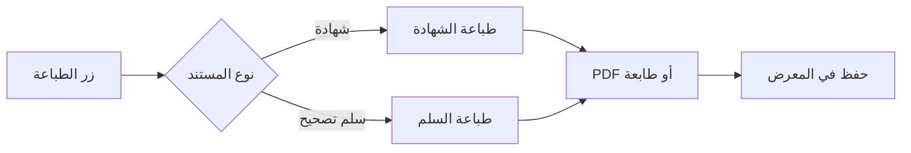
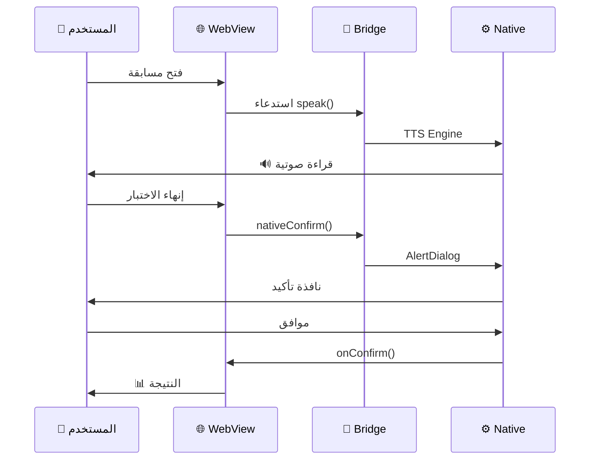
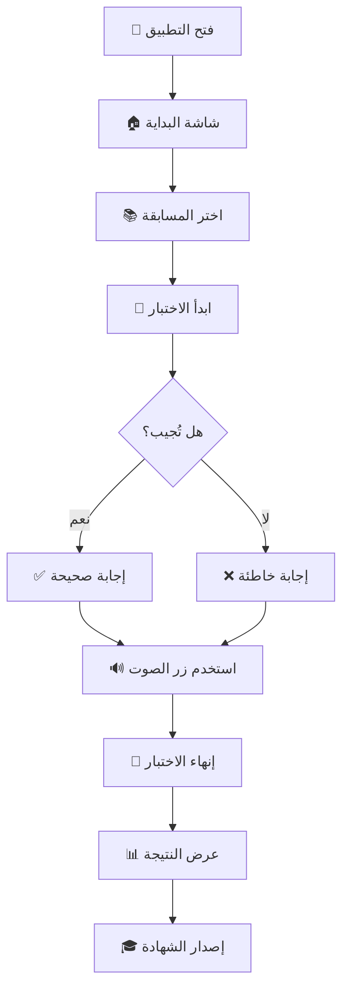
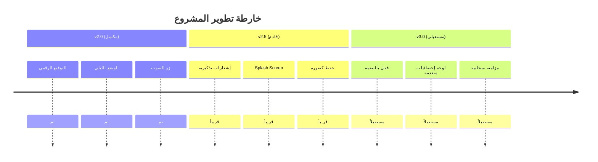

<div align="center">

### 🌟 منصة M.A للتدريب والتأهيل المهني

</div>

**منصة M.A للتدريب والتأهيل المهني** هي تطبيق أندرويد تفاعلي متطور، مُصمم لتهيئة وإعداد الكوادر البشرية لاجتياز المسابقات الرسمية والتأهيلية في المجالات **القانونية** و**الرقابية** و**الإدارية** و**التقنية**. يعتمد التطبيق على تقنيات حديثة تجمع بين `WebView` و `Java Native Bridge` لتقديم تجربة تدريبية متكاملة واحترافية.

<br>

<div align="center">

<table>
<tr>
<td align="center" width="25%">
<h3>🎯</h3>
<b>محاكاة كاملة</b>
<br>
<sub>لبيئة الاختبارات الرسمية</sub>
</td>
<td align="center" width="25%">
<h3>📚</h3>
<b>بنوك أسئلة ضخمة</b>
<br>
<sub>أكثر من 970 سؤال</sub>
</td>
<td align="center" width="25%">
<h3>🔊</h3>
<b>دعم صوتي كامل</b>
<br>
<sub>قراءة صوتية ذكية</sub>
</td>
<td align="center" width="25%">
<h3>🎓</h3>
<b>شهادات معتمدة</b>
<br>
<sub>قابلة للطباعة</sub>
</td>
</tr>
</table>

</div>

<br>

### 🎯 الرؤية والأهداف

<table>
<tr>
<td width="15%" align="center">🎯</td>
<td>

**الرؤية**
> _"البيئة التفاعلية المتطورة لإعداد الكوادر المؤهلة والمنافسة"_

</td>
</tr>
</table>

**الأهداف الاستراتيجية:**

- 📚 **الإعداد المهني** — تهيئة المتدربين لاجتياز المسابقات الحكومية بكفاءة
- 🎯 **المحاكاة الواقعية** — توفير بيئة اختبار مطابقة للنظام الرسمي
- 📊 **التقييم الشامل** — تقديم تقارير أداء تفصيلية حسب المحاور
- 🎓 **التوثيق والتحفيز** — إصدار شهادات تدريبية 
- 🔊 **سهولة الوصول** — دعم القراءة الصوتية لذوي الاحتياجات
- 🛡️ **الأمان** — حماية كاملة للبيانات ومنع التسريب

</div>

---

<!-- ═══════════════ الميزات الرئيسية ═══════════════ -->

<div dir="rtl">

## ✨ الميزات الرئيسية

### 🖥️ الميزات الأساسية

<table>
<thead>
<tr>
<th width="8%" align="center">الأيقونة</th>
<th width="25%">الميزة</th>
<th>الوصف التفصيلي</th>
</tr>
</thead>
<tbody>
<tr>
<td align="center">📝</td>
<td><b>10 مسابقات متخصصة</b></td>
<td>بنوك أسئلة شاملة في القوانين السورية و ICDL</td>
</tr>
<tr>
<td align="center">🎲</td>
<td><b>سحب عشوائي ذكي</b></td>
<td>خلط الأسئلة والخيارات في كل جلسة لضمان التنوع</td>
</tr>
<tr>
<td align="center">⏱️</td>
<td><b>مؤقت ذكي</b></td>
<td>لكل مسابقة وقت محدد وفق النظام الرسمي</td>
</tr>
<tr>
<td align="center">📊</td>
<td><b>تحليل الأداء</b></td>
<td>تقرير مفصّل حسب المحاور التدريبية</td>
</tr>
<tr>
<td align="center">📜</td>
<td><b>إصدار شهادات</b></td>
<td>شهادات احترافية قابلة للطباعة بصيغة PDF</td>
</tr>
<tr>
<td align="center">🔑</td>
<td><b>سلم تصحيح كامل</b></td>
<td>مراجعة جميع الأسئلة والإجابات النموذجية</td>
</tr>
</tbody>
</table>

---

### 🔊 ميزات الصوت والوصول

<table>
<tr>
<td width="50%" valign="top">

#### 🎙️ القراءة الصوتية
- ✅ صوت عربي طبيعي (Text-to-Speech)
- ✅ تحكم تلقائي بالسرعة (0.92x)
- ✅ ضبط النبرة للوضوح
- ✅ دعم كامل للغة العربية (ar-SA)

</td>
<td width="50%" valign="top">

#### 🔊 زر الصوت العائم
- ✅ يظهر في جميع الصفحات
- ✅ قابل للتحكم (تشغيل/إيقاف)
- ✅ لا يُعيق المحتوى
- ✅ تصميم أنيق متناسق

</td>
</tr>
</table>

---

### 🎨 ميزات التصميم

<div align="center">

```

╔══════════════════════════════════════════════════╗
║  🌙 وضع ليلي/نهاري تلقائي حسب النظام            ║
║  🎨 هوية بصرية موحّدة (كحلي + ذهبي)              ║
║  📱 تصميم متجاوب مع جميع أحجام الشاشات            ║
║  ✨ رسوم متحركة سلسة عند التفاعل                 ║
║  🎯 أيقونات SVG احترافية                         ║
╚══════════════════════════════════════════════════╝

```

</div>

---

### 📳 ميزات اللمس والتفاعل

| الميزة | الوصف | الحالة |
|--------|-------|--------|
| **اهتزاز تفاعلي** | عند الإجابة والنقر على الأزرار | ✅ |
| **نافذة تأكيد أصلية** | AlertDialog بدل HTML confirm | ✅ |
| **زر رجوع ذكي** | تحذير قبل الخروج من التطبيق | ✅ |
| **حفظ تلقائي** | حفظ التقدم في localStorage | ✅ |

---

### 🖨️ ميزات الطباعة



---

🔒 ميزات الأمان

<div align="center">

🛡️ الحماية التفاصيل
منع لقطات الشاشة FLAG_SECURE أثناء الاختبار
حفظ محلي جميع البيانات على الجهاز فقط
توقيع رقمي Release Keystore (RSA 2048)
مشاركة آمنة عبر Intent الرسمي لأندرويد

</div>

</div>

---

<!-- ═══════════════ لوحة الإحصائيات ═══════════════ -->

<div dir="rtl">

📊 لوحة الإحصائيات

<div align="center">

<table>
<tr>
<td align="center" width="25%">

<br><b>مسابقات متخصصة</b>
</td>
<td align="center" width="25%">

<br><b>سؤال تدريبي</b>
</td>
<td align="center" width="25%">

<br><b>درجة النجاح</b>
</td>
<td align="center" width="25%">

<br><b>مدة الاختبار</b>
</td>
</tr>
</table>

</div>

</div>

---

<!-- ═══════════════ البنية التقنية ═══════════════ -->

<div dir="rtl">

🏗️ البنية التقنية

⚙️ التقنيات المستخدمة

<table>
<tr>
<td width="50%" valign="top">

```yaml
📱 Platform:    Android
   └─ API 21+ (Android 5.0+)
   └─ Target: API 34

☕ Language:    Java
   └─ Version: 8
   └─ Style: Object-Oriented

🎨 UI Layer:    WebView
   └─ HTML5 + CSS3
   └─ JavaScript ES6

⚡ Bridge:      JavaScript Interface
   └─ Native ↔ Web Communication

🔊 TTS:         TextToSpeech
   └─ Arabic (ar-SA)
   └─ Female voice preferred

🎯 Build:       Gradle
   └─ Version: 8.1
   └─ Android Plugin: 8.1.0

🔧 CI/CD:       GitHub Actions
   └─ Automated Builds
   └─ Signed Releases
```

</td>
<td width="50%" valign="top">

🏛️ المعمارية العامة

```
┌───────────────────────────────────┐
│      MainActivity.java            │
│  ┌─────────────────────────────┐  │
│  │   WebView (HTML Renderer)   │  │
│  │  ┌───────────────────────┐  │  │
│  │  │   10 Exam Pages       │  │  │
│  │  │   + index.html Hub    │  │  │
│  │  └───────────────────────┘  │  │
│  └─────────────────────────────┘  │
│              ↕ Bridge             │
│  ┌─────────────────────────────┐  │
│  │    AndroidBridge Class      │  │
│  │  • nativeConfirm()          │  │
│  │  • nativeAlert()            │  │
│  │  • print()                  │  │
│  │  • speak() / stopSpeak()    │  │
│  │  • hapticLight()            │  │
│  │  • shareText()              │  │
│  │  • saveImageToGallery()     │  │
│  │  • setNightMode()           │  │
│  └─────────────────────────────┘  │
└───────────────────────────────────┘
```

</td>
</tr>
</table>

🔄 تدفق العمل



</div>

---

<!-- ═══════════════ المسابقات المتوفرة ═══════════════ -->

<div dir="rtl">

📚 المسابقات المتوفرة

<div align="center">

🎯 10 مسابقات متخصصة — أكثر من 970 سؤال تدريبي

</div>

<table>
<thead>
<tr>
<th width="5%" align="center">#</th>
<th width="30%">📚 المسابقة</th>
<th width="30%">⚖️ المرجع القانوني</th>
<th width="15%" align="center">📝 الأسئلة</th>
<th width="20%" align="center">⏱️ المدة</th>
</tr>
</thead>
<tbody>
<tr>
<td align="center"><b>01</b></td>
<td>💻 <b>اختبار ICDL الحكومي</b></td>
<td>ICDL المتقدم</td>
<td align="center"><code>200</code></td>
<td align="center">90 دقيقة</td>
</tr>
<tr>
<td align="center"><b>02</b></td>
<td>📜 <b>قانون العاملين الأساسي</b></td>
<td>المرسوم 50/2004</td>
<td align="center"><code>160</code></td>
<td align="center">90 دقيقة</td>
</tr>
<tr>
<td align="center"><b>03</b></td>
<td>🔍 <b>مفتش معاون شامل</b></td>
<td>الجهاز المركزي</td>
<td align="center"><code>100</code></td>
<td align="center">50 دقيقة</td>
</tr>
<tr>
<td align="center"><b>04</b></td>
<td>💰 <b>قانون الجهاز المركزي للرقابة المالية</b></td>
<td>المرسوم 64/2003</td>
<td align="center"><code>80</code></td>
<td align="center">80 دقيقة</td>
</tr>
<tr>
<td align="center"><b>05</b></td>
<td>📋 <b>النظام الداخلي للجهاز المركزي</b></td>
<td>القرار 4/2015</td>
<td align="center"><code>60</code></td>
<td align="center">60 دقيقة</td>
</tr>
<tr>
<td align="center"><b>06</b></td>
<td>💵 <b>القانون المالي الأساسي</b></td>
<td>المرسوم 54/2006</td>
<td align="center"><code>50</code></td>
<td align="center">50 دقيقة</td>
</tr>
<tr>
<td align="center"><b>07</b></td>
<td>📄 <b>قانون العقود الموحد</b></td>
<td>المرسوم 51/2004</td>
<td align="center"><code>80</code></td>
<td align="center">72 دقيقة</td>
</tr>
<tr>
<td align="center"><b>08</b></td>
<td>📑 <b>دفتر الشروط العامة</b></td>
<td>المرسوم 450/2004</td>
<td align="center"><code>80</code></td>
<td align="center">72 دقيقة</td>
</tr>
<tr>
<td align="center"><b>09</b></td>
<td>⚖️ <b>قوانين العقوبات والبينات</b></td>
<td>148/1949 + 3/2013 + 359/1947</td>
<td align="center"><code>60</code></td>
<td align="center">60 دقيقة</td>
</tr>
<tr>
<td align="center"><b>10</b></td>
<td>🏛️ <b>قانون الهيئة المركزية للرقابة والتفتيش</b></td>
<td>المرسوم 24/1981</td>
<td align="center"><code>100</code></td>
<td align="center">90 دقيقة</td>
</tr>
</tbody>
<tfoot>
<tr>
<td colspan="3" align="center"><b>🔢 المجموع الإجمالي</b></td>
<td align="center"><b>970+</b></td>
<td align="center"><b>—</b></td>
</tr>
</tfoot>
</table>

</div>

---

<!-- ═══════════════ هيكل المشروع ═══════════════ -->

<div dir="rtl">

📁 هيكل المشروع

```
📦 ma-platform-android/
│
├── 📁 .github/                          # ⚙️ إعدادات GitHub
│   └── 📁 workflows/
│       └── 📄 build.yml                 # 🏗️ سير عمل البناء الآلي
│
├── 📄 settings.gradle                   # ⚙️ إعدادات Gradle العامة
├── 📄 build.gradle                      # 📦 إعدادات المشروع الرئيسي
├── 📄 gradle.properties                 # 🔧 خصائص Gradle
├── 📄 README.md                         # 📖 هذا الملف
│
└── 📁 app/                              # 📱 وحدة التطبيق
    │
    ├── 📄 build.gradle                  # 📦 إعدادات وحدة app
    ├── 📄 proguard-rules.pro            # 🛡️ قواعد ProGuard
    │
    └── 📁 src/main/                     # 📂 المصدر الرئيسي
        │
        ├── 📄 AndroidManifest.xml       # 📋 بيان التطبيق
        │
        ├── 📁 java/com/maplatform/app/  # ☕ كود Java
        │   └── 📄 MainActivity.java     # 🎯 النشاط الرئيسي
        │
        ├── 📁 res/                      # 🎨 الموارد
        │   │
        │   ├── 📁 values/               # 📝 القيم
        │   │   ├── 📄 strings.xml       # 📚 النصوص
        │   │   ├── 📄 colors.xml        # 🎨 الألوان
        │   │   └── 📄 themes.xml        # 🌙 الثيمات
        │   │
        │   ├── 📁 drawable/             # 🖼️ الرسومات
        │   │   ├── 📄 ic_launcher.png   # ⭐ أيقونة التطبيق
        │   │   └── 📄 ic_notification.xml
        │   │
        │   └── 📁 mipmap-*/             # 📱 أيقونات بأحجام متعددة
        │       └── 📄 ic_launcher.png
        │
        └── 📁 assets/                   # 🌐 صفحات HTML
            ├── 📄 index.html            # 🏠 الواجهة الرئيسية
            ├── 📄 app1.html             # 💻 ICDL
            ├── 📄 app2.html             # 📜 قانون العاملين
            ├── 📄 app3.html             # 🔍 مفتش معاون
            ├── 📄 app4.html             # 💰 الجهاز المركزي
            ├── 📄 app5.html             # 📋 النظام الداخلي
            ├── 📄 app6.html             # 💵 القانون المالي
            ├── 📄 app7.html             # 📄 العقود الموحد
            ├── 📄 app8.html             # 📑 دفتر الشروط
            ├── 📄 app9.html             # ⚖️ العقوبات والبينات
            └── 📄 app10.html            # 🏛️ الهيئة المركزية
```

</div>

---

<!-- ═══════════════ المتطلبات التقنية ═══════════════ -->

<div dir="rtl">

🔧 المتطلبات التقنية

📱 متطلبات النظام

<table>
<tr>
<td width="35%"><b>المتطلب</b></td>
<td width="65%"><b>الحد الأدنى</b></td>
</tr>
<tr><td>📱 نظام التشغيل</td><td><code>Android 5.0 (API 21)</code></td></tr>
<tr><td>💾 المساحة</td><td><code>~5 ميجابايت</code></td></tr>
<tr><td>🧠 الذاكرة</td><td><code>512 ميجابايت RAM</code></td></tr>
<tr><td>📶 الاتصال</td><td><code>غير مطلوب — يعمل دون إنترنت</code></td></tr>
<tr><td>🔊 الصوت</td><td><code>محرك TTS عربي (اختياري)</code></td></tr>
</table>

🛠️ متطلبات البناء

<table>
<tr>
<td width="35%"><b>المتطلب</b></td>
<td width="65%"><b>الإصدار</b></td>
</tr>
<tr><td>☕ Java JDK</td><td><code>17+</code></td></tr>
<tr><td>🎯 Gradle</td><td><code>8.1</code></td></tr>
<tr><td>📱 Android SDK</td><td><code>API 34</code></td></tr>
<tr><td>🔧 Build Tools</td><td><code>34.0.0</code></td></tr>
<tr><td>📦 Android Plugin</td><td><code>8.1.0</code></td></tr>
</table>

</div>

---

<!-- ═══════════════ دليل البناء والتثبيت ═══════════════ -->

<div dir="rtl">

🚀 دليل البناء والتثبيت

🌐 الطريقة الأولى: عبر GitHub Actions ⭐ موصى بها

<div align="center">

🕐 الوقت المتوقع: 5 دقائق

</div>

1️⃣ تجهيز المستودع

```bash
# انسخ المستودع
git clone https://github.com/mezo2021/ma-platform-android.git
cd ma-platform-android
```

2️⃣ إضافة Keystore للتوقيع

<div align="center">

اذهب إلى: Settings → Secrets and variables → Actions

</div>

🔐 الاسم 📝 الوصف
KEYSTORE_BASE64 مفتاح التوقيع بصيغة Base64
KEYSTORE_PASSWORD كلمة مرور الـ Keystore
KEY_ALIAS اسم المفتاح
KEY_PASSWORD كلمة مرور المفتاح

3️⃣ تشغيل البناء

1. اذهب إلى Actions → Build Signed APK
2. اضغط Run workflow ⚡
3. انتظر 2-3 دقائق ⏳
4. حمّل APK من قسم Artifacts 📥

---

💻 الطريقة الثانية: البناء المحلي

المتطلبات

```bash
# تأكد من تثبيت JDK 17
java -version

# تأكد من تثبيت Gradle
gradle --version
```

خطوات البناء

```bash
# 1. نسخ المستودع
git clone https://github.com/mezo2021/ma-platform-android.git
cd ma-platform-android

# 2. البناء
gradle assembleRelease

# 3. الملف الناتج في:
# app/build/outputs/apk/release/app-release.apk
```

</div>

---

<!-- ═══════════════ دليل الاستخدام ═══════════════ -->

<div dir="rtl">

🎯 دليل الاستخدام

📲 التثبيت

<table>
<tr>
<td align="center" width="60px"><b>1</b></td>
<td>حمّل ملف <code>app-release.apk</code></td>
</tr>
<tr>
<td align="center"><b>2</b></td>
<td>افتحه على هاتفك</td>
</tr>
<tr>
<td align="center"><b>3</b></td>
<td>اسمح بـ "المصادر غير المعروفة" إن طُلب</td>
</tr>
<tr>
<td align="center"><b>4</b></td>
<td>اضغط <b>تثبيت</b></td>
</tr>
</table>

🎮 خطوات الاستخدام



🔊 استخدام ميزة الصوت

<table>
<tr>
<td width="20%" align="center">🔊</td>
<td>

زر الصوت العائم — موجود أسفل يسار الشاشة

· اضغط 🔊 → يقرأ نص السؤال بصوت عالٍ
· اضغط ⏹ → يوقف القراءة فوراً
· يعمل في جميع الصفحات والصفحات

</td>
</tr>
</table>

🖨️ الطباعة

<table>
<tr>
<td width="50%">

🎓 طباعة الشهادة

1. اضغط "🖨 طباعة الشهادة"
2. اختر طابعة أو Save as PDF
3. احفظ الملف

</td>
<td width="50%">

🔑 طباعة سلم التصحيح

1. اضغط "🖨 طباعة سلم التصحيح"
2. يعرض جميع الأسئلة والإجابات
3. اطبعها للمراجعة

</td>
</tr>
</table>

</div>

---

<!-- ═══════════════ الأمان والخصوصية ═══════════════ -->

<div dir="rtl">

🔐 الأمان والخصوصية

<div align="center">

🛡️ خصوصيتك أولويتنا

</div>

<table>
<tr>
<td width="50%" valign="top">

✅ ما نفعله

· ✅ حفظ جميع البيانات محلياً على جهازك
· ✅ منع لقطات الشاشة أثناء الاختبار
· ✅ توقيع التطبيق رقمياً
· ✅ تشفير Keystore بكلمة مرور قوية

</td>
<td width="50%" valign="top">

❌ ما لا نفعله

· ❌ لا نرسل بياناتك للإنترنت
· ❌ لا نتبع سلوك المستخدم
· ❌ لا نستخدم تحليلات خارجية
· ❌ لا نشارك بياناتك مع أي طرف

</td>
</tr>
</table>

🔑 تفاصيل التوقيع الرقمي

<table>
<tr>
<td width="30%"><b>الخاصية</b></td>
<td width="70%"><b>القيمة</b></td>
</tr>
<tr><td>🔐 نوع المفتاح</td><td><code>RSA</code></td></tr>
<tr><td>📏 الحجم</td><td><code>2048 بت</code></td></tr>
<tr><td>🔒 الخوارزمية</td><td><code>SHA-256</code></td></tr>
<tr><td>📅 الصلاحية</td><td><code>10,000 يوم (~27 سنة)</code></td></tr>
<tr><td>🏷️ Alias</td><td><code>ma-platform-key</code></td></tr>
</table>

</div>

---

<!-- ═══════════════ المساهمة ═══════════════ -->

<div dir="rtl">

🤝 المساهمة

<div align="center">

نرحب بمساهماتكم! 🌟

</div>

📝 خطوات المساهمة

```bash
# 1. Fork المستودع
# اضغط زر Fork في الأعلى

# 2. استنسخ نسختك
git clone https://github.com/YOUR_USERNAME/ma-platform-android.git

# 3. أنشئ فرعاً جديداً
git checkout -b feature/AmazingFeature

# 4. اعمل على الميزة
# ...

# 5. Commit التعديلات
git commit -m 'Add AmazingFeature'

# 6. Push للفرع
git push origin feature/AmazingFeature

# 7. افتح Pull Request
```

🐛 الإبلاغ عن المشاكل

عند فتح Issue جديد، يرجى تضمين:

<table>
<tr>
<td align="center" width="60px">📝</td>
<td>وصف تفصيلي للمشكلة</td>
</tr>
<tr>
<td align="center">🔄</td>
<td>خطوات إعادة الإنتاج</td>
</tr>
<tr>
<td align="center">📸</td>
<td>لقطة شاشة إن أمكن</td>
</tr>
<tr>
<td align="center">📱</td>
<td>طراز الجهاز وإصدار أندرويد</td>
</tr>
<tr>
<td align="center">📋</td>
<td>نص رسالة الخطأ (إن وُجدت)</td>
</tr>
</table>

</div>

---

<!-- ═══════════════ سجل الإصدارات ═══════════════ -->

<div dir="rtl">

📅 سجل الإصدارات

<table>
<tr>
<td width="20%" align="center">

🎉 v2.0

<sub>الحالي</sub>

</td>
<td width="80%">

✨ الإضافات الجديدة

· ✅ التوقيع الرقمي — Release Keystore
· ✅ تحسين الأمان — منع لقطات الشاشة
· ✅ زر الصوت العائم — في كل الصفحات
· ✅ اهتزاز تفاعلي — عند اللمس
· ✅ الوضع الليلي — تلقائي حسب النظام
· ✅ نافذة تأكيد أصلية — AlertDialog

</td>
</tr>
<tr>
<td align="center">

🚀 v1.0

</td>
<td>

🎯 الإطلاق الأولي

· ✅ إطلاق المنصة الأساسية
· ✅ 10 مسابقات تدريبية
· ✅ نظام التقارير
· ✅ إصدار الشهادات

</td>
</tr>
</table>

🛣️ خارطة الطريق



</div>

---

<!-- ═══════════════ الترخيص ═══════════════ -->

<div dir="rtl">

📜 الترخيص

<div align="center">

<table>
<tr>
<td align="center">

🎓 ترخيص منصة M.A

هذا المشروع مرخّص تحت رخصة M.A

</td>
</tr>
</table>

📋 ملخص الترخيص

✅ مسموح            ❌ ممنوع
✅ الاستخدام الشخصي    ❌ البيع التجاري
✅ التعديل والتطوير      ❌ إزالة حقوق المؤلف
✅ التوزيع المجاني       ❌ الاستخدام التجاري
✅ المساهمة            ❌ إعادة الترخيص

للتفاصيل الكاملة: انظر ملف LICENSE

</div>

</div>

---

<!-- ═══════════════ التواصل ═══════════════ -->

<div dir="rtl">

📞 التواصل

<div align="center">

🎓 منصة M.A للتدريب والتأهيل المهني

<br>

<table>
<tr>
<td align="center" width="33%">

👨‍💼 المصمم والمطور

أ. مصطفى علي اكر

</td>
<td align="center" width="33%">

📧 البريد الإلكتروني

mostafaalim10m@gmail.com

</td>
<td align="center" width="33%">

🌐 GitHub

@mezo2021

</td>
</tr>
</table>

<br>

<a href="https://github.com/mezo2021/ma-platform-android">

</a>


<a href="https://github.com/mezo2021/ma-platform-android/fork">

</a>

<a href="https://github.com/mezo2021/ma-platform-android/issues">

</a>

</div>

</div>

---

<!-- ═══════════════ رسالة ختامية ═══════════════ -->

<div align="center" dir="rtl">


🤲 صدقة جارية

<table>
<tr>
<td align="center">

✨ هذا العمل لوجه الله تعالى ✨

<br>

نسأل الله أن ينفع بهذا العمل، وأن يجعله في ميزان حسناتنا

وأن يجعله علماً يُنتفع به، وصدقةً جاريةً إلى يوم الدين

<br>

﴿وَمَا تَوْفِيقِي إِلَّا بِاللَّهِ عَلَيْهِ تَوَكَّلْتُ وَإِلَيْهِ أُنِيبُ﴾

<sub>— سورة هود، الآية 88 —</sub>

</td>
</tr>
</table>

<br>


<br>

صُنع بـ ❤️ في سوريا 

<br>

© 2026 منصة M.A للتدريب والتأهيل المهني — جميع الحقوق محفوظة

<br>

<sub>آخر تحديث: 2026</sub>

</div>
```

---
